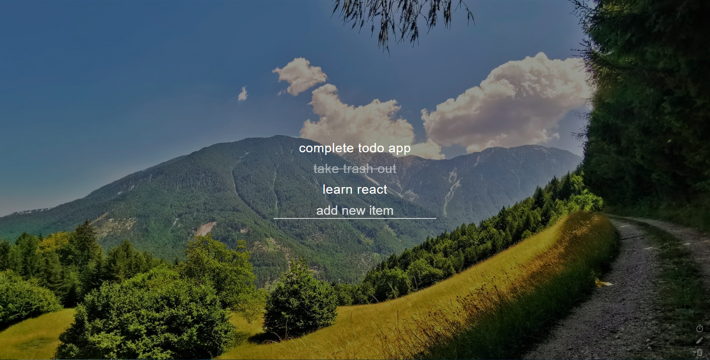
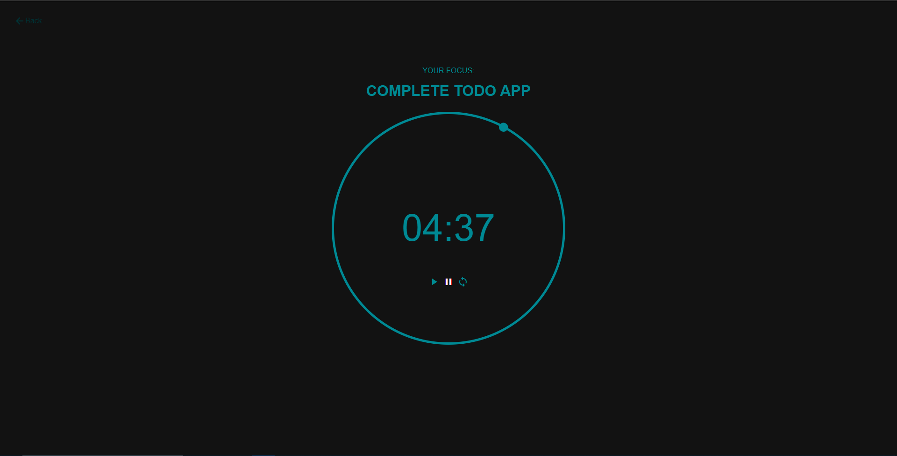

# Todo List
My version of a to do list made from HTML, CSS and vanilla JavaScript

The todo list is inspired by the simple design of the popular chrome extension Momentum

The app comes with a builted in focus count down timer with your selected to do item

